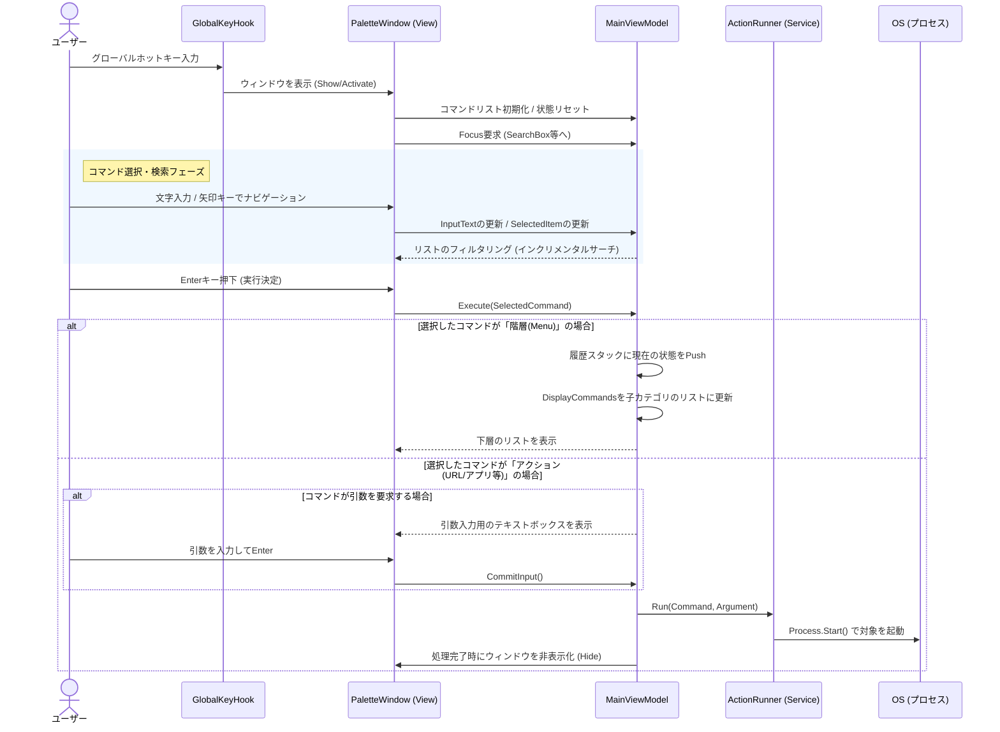
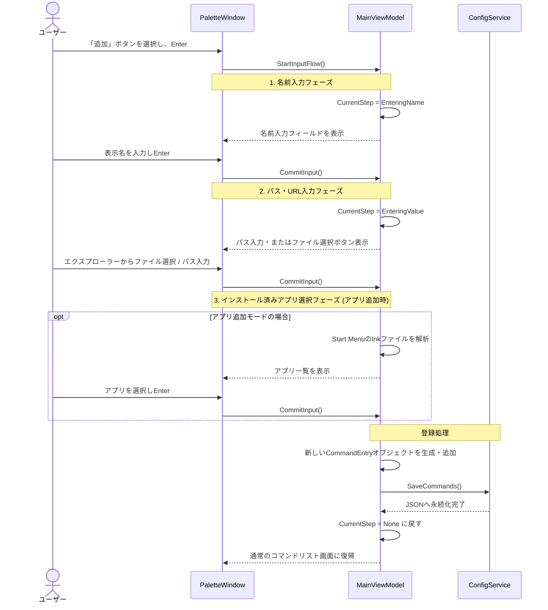
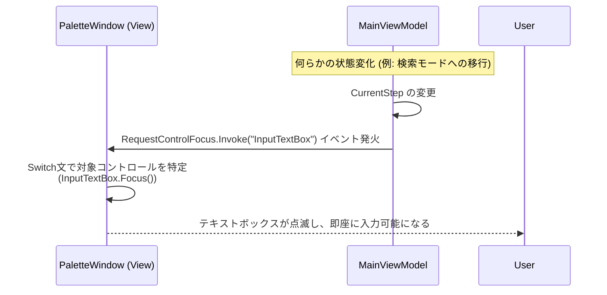

# HotKeyApp アーキテクチャと処理フロー

本ドキュメントでは、HotKeyAppの全体的な構成と、ユーザーの操作に伴う処理の流れをMermaidのシーケンス図を用いて詳解します。

## 1. アプリケーションの全体構成

このアプリは **WPF (Windows Presentation Foundation)** をベースとし、**MVVM (Model-View-ViewModel)** パターンを採用しています。主な構成要素は以下の通りです。

- **Views (`PaletteWindow.xaml` など)**:
  ユーザーとのインターフェース。キーボード入力の受け付け、フォーカス制御、コマンドのリスト表示を行います。
- **ViewModels (`MainViewModel.cs`)**:
  UIのロジックと状態管理を担当します。履歴の管理、検索フィルタリング、コマンド追加時のウィザード進行などを司ります。
- **Services (`ActionRunner.cs`, `ConfigService.cs`)**:
  - `ActionRunner`: 実際のコマンド実行 (URL, バッチ, 実行ファイル起動など) を `Process.Start` 経由で行います。
  - `ConfigService`: コマンド構造や設定をJSONファイルと同期・保存・読み込みします。

---

## 2. コマンド実行のシーケンス（メインフロー）

ユーザーがグローバルホットキーを押下してから、選択したアクションがシステム上で実行されるまでの一連の流れです。

---

## 3. 新規コマンド追加のシーケンス

コマンドパレット上から「＋ アプリを追加...」などのボタンを選択し、新しいショートカットを登録する際のウィザード形式のフローです。

---

## 4. ウィンドウとフォーカス管理の連携

キーボード駆動のUIを実現するため、ViewとViewModel間でのフォーカス要求システムがあります。（例：リストからテキストボックスへのフォーカス移動）

## 今後の拡張性について

現在の構成における主な結合度は以下のようになっており、プロジェクトの進化に伴う影響範囲は局所化されています。

- **新しい機能 (テンプレート) の追加**: `presets.json` に新しいプリセットを定義し、必要に応じて `ActionRunner.Run` や `MainViewModel` にロジックを追加するだけで動作します。
- **UIの大規模変更**: デザインの変更やアニメーションの追加があっても、ロジック自体は `MainViewModel` に閉じているため、XAML側の修正を中心に進めることが可能です。
